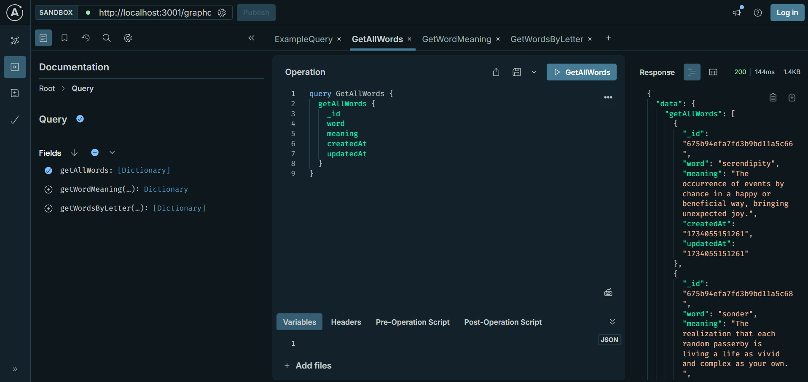
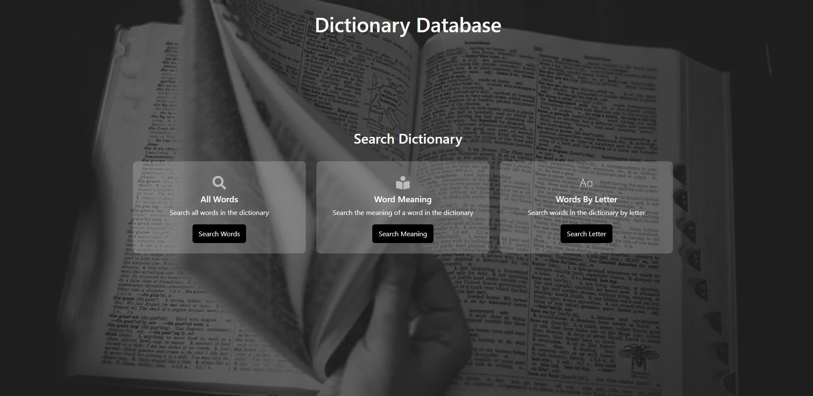

[](https://opensource.org/licenses/MIT)

# Dictionary DB

## Description
This project was motivated by my desire to deepen my understanding of the MERN stack, with a particular focus on Mongoose and its role in managing MongoDB databases. I wanted to apply and strengthen the skills I developed during my coding bootcamp by building a functional and purposeful application. Creating a dictionary API provided an excellent opportunity to design efficient database schemas, write resolvers, and test GraphQL queries while solving a practical problem.

The application addresses the need for retrieving dictionary data in a flexible and efficient way. Users can fetch all stored words, look up the meaning of a specific word, or find words that start with a specific letter. These features demonstrate how back-end technologies can seamlessly handle structured data queries with intuitive front-end interfaces.

Through this project, I learned how to structure a back-end application using Mongoose, convert SQL schema and seeds into Mongoose models and documents, and build GraphQL resolvers for complex queries.

Deployed Link: https://dictionary-db.onrender.com

## Table of Contents
- [Installation](#installation)
- [Usage](#usage)
- [License](#license)
- [Questions](#questions)

## Installation
1. **Clone the repository**

   Start by cloning the repository to your local machine using the following command:

   ```bash
   git clone git@github.com:RoryDowse/Dictionary-DB.git
   ```

2. **Install dependencies**

   Install the necessary dependencies with npm:

   ```bash
   npm install
   ```

3. **Build the application**

   Build the application to prepare for running:

   ```bash
   npm run build
   ```

4. **Create a database on MongoDB Atlas**

	- Log in to your MongoDB Atlas account
	- Navigate to Browse Collections and click Create Database.
	- Set up Network Access by allowing access to your IP address.

	
5. **Update the environment variable**

   After setting up the database, update the .env file with your MongoDB URI:

   ```bash
   MONGODB_URL=<your-mongodb-uri>
   ```

6. **Seed the database**

   Seed your database with the initial data by running:

   ```bash
   npm run seed
   ```

7. **Start the application**

   Start the server to launch the application:

   ```bash
   npm run start
   ```

## Usage

When the server is running in the Command Line Interface (CLI), open Apollo Server Sandbox by selecting:

Use GraphQL at http://localhost:3001/graphql

Then:

1. **Run getAllWords**

	- Add the desired fields, i.e. all fields 
	- Run "GetAllWords"

2. **Run getWordMeaning**

	- Add the desired fields, i.e. "word" and "meaning"
	- Add a word that exists in the dictionary to the Variables input, i.e. "serendipity"
	- Run "GetWordMeaning"

3. **Run getWordsByLetter**

	- Add the desired fields, i.e. "word" and "meaning"
	- Add a letter that exists in the dictionary to the Variables input
	- Run "getWordsByLetter", i.e. "e"

GraphQL Sandbox:



Homepage:




## License
This project is licensed under the MIT license.

## Questions
Please visit my GitHub profile: https://github.com/RoryDowse.<br>
For additional questions, please contact me at: rorydowse@hotmail.com.
